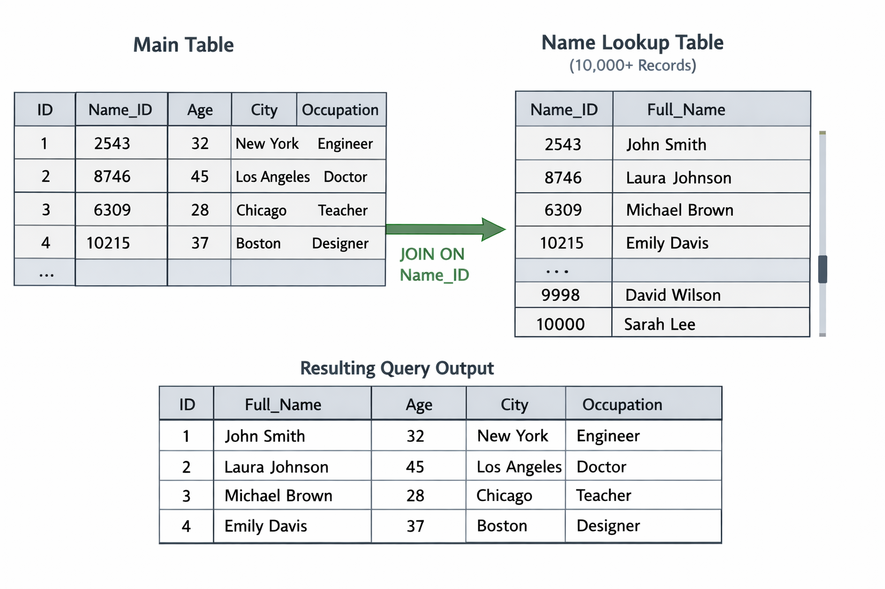
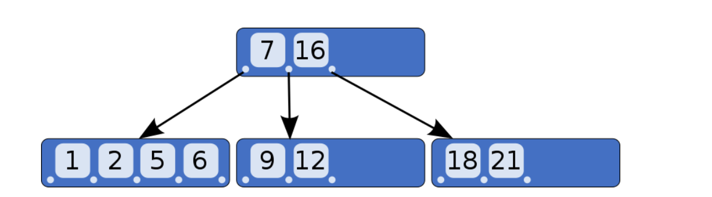

NodeJS with mysql

# 1. Mysql
It is software store and retrive data, query can be done to DB using sql (structure query launguage)

# 2. Tables
Rows and columns of data

# 3. Schema
Meta information about table, like structure and other objects how they relate , views also included

# 4.  Views 

Virtual table -> create when we need to hide some coloumns from actual table

# 5. Primary key
Should be uniqe
Not null
can applied to one column in table

# 6. Foreign Key 

Used to build relationship bewtween tables
Foreign key can primary key in other table
Foreign key can be null

# 7. Unique key
name itlsef suggest unique
can be null
we can have mutiple unique keys
example: email, phone number

# 8. CHAR vs VARCHAR

CHAR(5)
-------
code -> "A1   " 10 byte -> it will take full size
it is faster 

VARCHAR(10) -> max 10 char allowed

code -> "A1"+ 1byte

# 9. Indexing 

1. Indexing is used to make query db faster

2. To create index -> there will be a new `lookup table` is created which maintain index id

3. example: we know data is stored in disc (512GB) 

    Disc is devided into sectors 

    Sector A - 128
    Sector B - 128
    Sector C - 128
    Sector D - 128

    when select query performed

    select * from emplyee where full_name = "nizam";

    it search entire disc 

    by maintaining lookup table it maintanin range data for each sector, to perform search it uses B-tree which like perform search on range

    

4. How search works if i search by name

    select * from emplyee where full_name = "nizam"; --- `index works`
    select * from emplyee where full_name = "niz%"; --- `index works` because search with prefix

    select * from emplyee where full_name = "%iz%"; --- `not index works` because iz will search in all table for matching

    select * from emplyee where full_name = "%izam"; also not works because indexing works with prefix search

6. First search is performed on lookup table then actual table

7. We have limits for indexing it depends on mysql

8. banlenced tree -> perform search based on range

# 10. Joins
  
   1. Inner join
    matching data in both table

  

   2. Left Join
    All data from left table and matching data form right table , it can have Null values

  

   3. Right Join
    All data from Right table and matching data form left table , it can have Null values

  
  
   4. Full Outer join 
    All data from Right table and all data form left table , it can have Null values

    left + union + right

  

# 11. ACID property (acid applied  with transaction, without transaction not fully applied)

   1. Atomocity - All operations in a transaction succeed or none do.

        START TRANSACTION;
        UPDATE a SET balance = balance - 100 WHERE id = 1;
        UPDATE b SET balance = balance + 100 WHERE id = 2;
        COMMIT;

   2. Consistency - A transaction moves the database from one valid state to another. (Ensures data follows rules, constraints, and business logic.)
      Constraints: PRIMARY KEY, FOREIGN KEY, UNIQUE, CHECK

    1. rules are followed before starting transaction means check constraints
    2. rules are followed after transaction means check constracints after transaction

   3. Isolation - Transactions do not interfere with each other. (Prevents dirty reads, race conditions, and inconsistent data.)

   4. Durability - Once committed, data is permanently saved. (Protects data even after crashes or power failures.) by logs, caching etc

# 12. Dirty Reads

  Transcrtion A reads data , where other transaction B modifying that data but transaction B is not committed , it went rollback

  let check with example

  Transaction A  -> AMOUNT - 500

  TRANSACTION A
  -----------------

  START TRANSACTION;

  UPDATE ORDERS SET AMOUNT = 250 WHERE order_id = 1;  // UN COMMITTED

  TRANSACTION B
  --------------

  SELECT * FROM ORDERS WHERE order_id = 1;

  <!-- AMOUNT -> 250 -->

  TRANSACTION A
  -----------------

  ROLLBACK;

  TRANSACTION B perform dirty read , AMOUNT = 500, TRANSACTION B GOT AMOUNT = 250

  TO PREVENT
  1. Read committed
  2. serilizable
  3. repeatedly read

# 13. Race condition

  1. Using transaction

    START TRANSACTION;

     UPDATE CUSTOMER SET AMOUNT = 1000 WHERE ID = 1;

    COMMIT;

  2. Using row lock

    START TRANSACTION;

    SELECT * FROM ORDER WHERE CUSTOMER_ID = 1 FOR UPDATE;

    UPDATE CUSTOMER SET AMOUNT = 1000 WHERE ID = 1;

    COMMIT;

  3. using version LOCK

     UPDATE CUSTOMER SET AMOUNT = 1000 AND VERSION = VERSION + 1 WHERE ID = 1 AND VERSION = 2;

  4. Atomic Updates -> single query no race condtions

     UPDATE CUSTOMER SET AMOUNT = 1000 WHERE ID = 1;

  
# 14. Relational database

  1. Store and mange data using tabels
  2. table has rows(records) and columns (fields)
  3. tables are connected to each other by keys (Foreign keys)
  4. relational databases , Mysql, psql, sql lite, oracle
  5. Fixed schema 
  6. uses sql to query database
  7. fixed schema means structure is predefined and strict, we can add new field to table , new type of value to existing field
  8. Create table user (
    id number,
    name varchar(50),
    age number
  );

  9. insert into user(id,name, age, gender)
      values (1, "Nizam",27,"male"); this is nit allowed because table is created with diffrent schema

# 15. why we use Relational database
  1. structured data
  2. strong data consistency (ACID propoties)
  3. easy to query with sql

# 16. when we need relational database

  1. structred data
  2. data consistency (ACID)
  3. relationshipl between tables
  4. e-commerce applications 
    1. payments table
    2. orders table
    3. users table
    4. products table
  5. banking systems
  6. ticketing systems

# 17. when we need no sql 

  1. Data structure change
  2. Huge scale and high write traffic
  3. easy to horizontal scaling
  4. fatsre development
  5. majorely used 
    1. message application
    2. Analytics
    3. notifications
    4. acticity logs

# 18. Horizontal scaling in relational Database is painful

  1. horizontal scling means adding new machines and splitting data betweeen doffrent machines, where as vertical scaling updating existing machine
  2. why horizontal scaling is painful because relational DB will 
    1. maintain consistency in data (ACID)
    2. relation bewteen tables
    3. transactions
  it is difficult to maintain consistency , relations of do horizontal sclaing

  3. we can do Horizontal scaling
    1. creating replicas
      1. primary -> write allways on primary
      2. relicas -> read from replicas

    2. write still goes to one
    3. read lag (consistency)
  
  4. sharding
    
    shard1 -> 1 - 1m
    shard2 -> 1m - 2m
    shard3 -> 2m - 3m

    1. each shard seperate database
    2. read and write speed
    3. joins difficult

# 19. Transaction
    Group of database operations

    Begin;
    INSERT INTO orders (id, user_id, amount) VALUES (1, 10, 500);
    INSERT INTO payments (order_id, status) VALUES (1, 'SUCCESS');
    commit;

# 20. Diffrence between Psql vs mysql

1. Both are open source 
2. uses standard sql
3. Mysql speed and fast comapre to psql, great for read heavy web apps, fast for simple reads
4. pql is more advanced used for complex queries
5. Project is simple and performence-focused choose mysql, project is scalable, complex and advanced choose psql
6. Mysql is simple and light weight, faster for heavy-read applications and psql complex queries
7. mysql we can scale horizontal using replicas
8. psql vertically scales well
9. psql easy to perform search on json data means column which stores json data and it suuports JSONB
10. psql supports indexing json also
11. mysql json indexing is limited
12. Psql supports two json data types JSON and JSONB
13. JSON (Text storage)
    1. stored exactly as text
    2. every time query json data -> psql parses it
    3. key order preserved
    

14. JSONB (stored in binary format)
    1. stored as binary data
    2. parsed only at insert
    3. faster query
    4. support indexing
    5. key order not preserved

# 21. Bearer token vs cookies vs basic

  1. Bearer token
    1. access token used in api
    2. sent in http header (Authorization: Bearer <token>)
    3. session less used with jwt

  2. Cookies
    1. small piece of data stored by browser
    2. autometically sent with every request with same domain
    3. used for session and authentication

  3. Basic

    1. used when ur authenticating to application 
    2. basically passing username and password in encryption using base64 algo
  
  Both are used for 
  1. Authentication -> who you are -> authenticate application
  2. authorization -> you have access to following -> permissions

  what ever stored in cookies for that domain sent autometically to each n/w request
   works
  FE domain => app.example.com
  BE domain =>  app.example.com

  # 22. Commonly used API status codes

  1. 2XX -> success
    1. 200 -> GET, PUT, PATCH
    2. 201 -> Create new resource -> POST 
    3. 204 -> success no response , DELETE

  2. 4xx -> client error
    1. 400 -> missing fields -> bad request
    2. 401 -> Unauthorized ->not authenticated
    3. 403 -> Forbidden -> not allowed , no permission
    4. 404 -> Resource not found -> wrong id
    5. 409 -> conflict in data -> duplicate entry
    6. 429 -> too many request , rate limiter

  3. 5xx -> server errors

    1. 500 -> server crash
    2. 502 -> bad gateway -> service failure -> microservice failure
    3. 503 -> service unreachable -> load 
    4. 504 -> gate way timeout -> not responding

