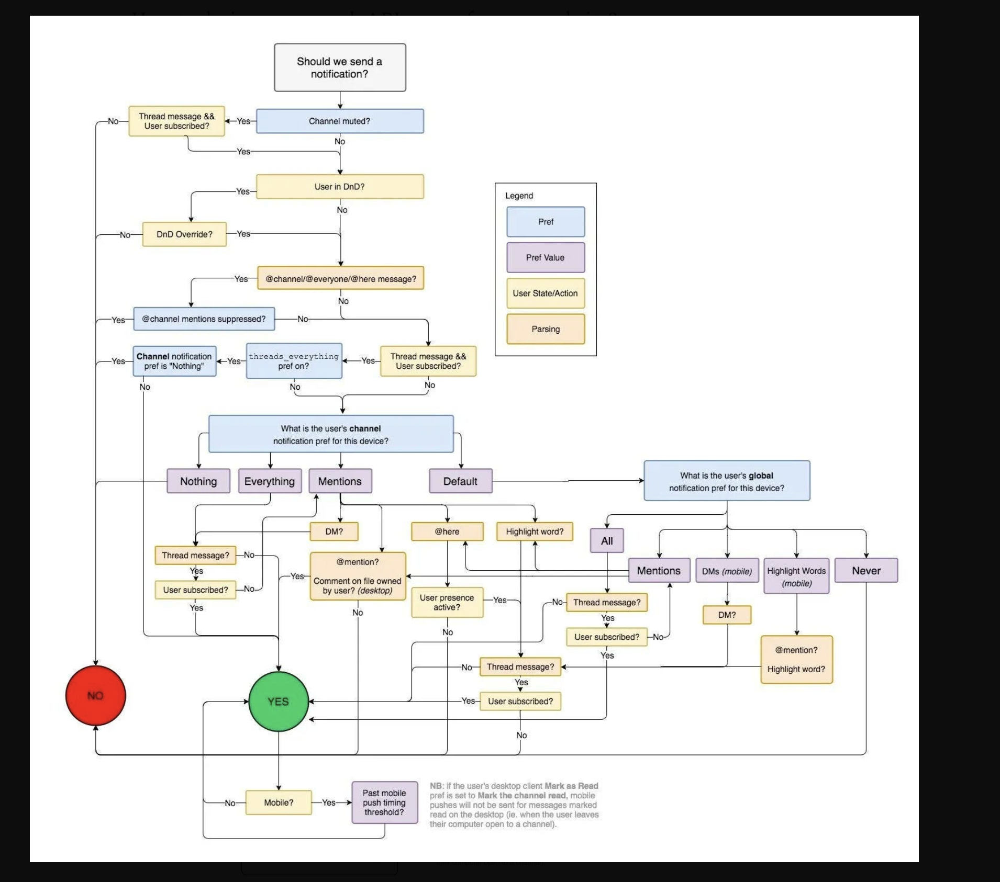

# How SSL certificate works

1. How data will shared between client and server securely
  1. Symmetric encryption
  2. Asymmetric encryption

2.  Symmetric encryption -> Only one key which is at client end , but at server no key, client encrypted data he has to send key as well  because of this MMA (Man in Middle Attacker) can get data and also key to encrypt
this is not valid solution

3. Asymmetric encryption

  1. Server -> has two keys
      1. Public key 
      2. private key
  2. Server share public key with client

    2.1 Client using public key generate SECRETE key send it to SERVER
    2.2 Encrypt data with that SECRETE key send it to server

  3. Server Decrypt it by private key

4. Asymmetric also has problem of hacker 

    1. Here hacker can proxy MMA 
    2. He can send new puclic key to client acting in middle
    3. He also have private key which is not server private key
    4. He can encrypt data in middle data get leak

5. To solve this MMA proxy problem we use SSL certificate

  1. lets encrypt -> orgnaisation which gives signed certificate to server
  2. server will send Public key to lets encrypt
  3. They create L private and L public key 
  4. Create certificate with signature
  5. Signature contains Signature = Server public key + lets encrypt Public key
  6. send certificate to servrer
  7. server send certificate to client and public key 
  8. client request lets encrypt give lets encrypt public key 
  9. client verify signature using lets encrypt public key  and servre public key 
  10. generate SECRATE KEY send it to server 
  11. send encryption data
