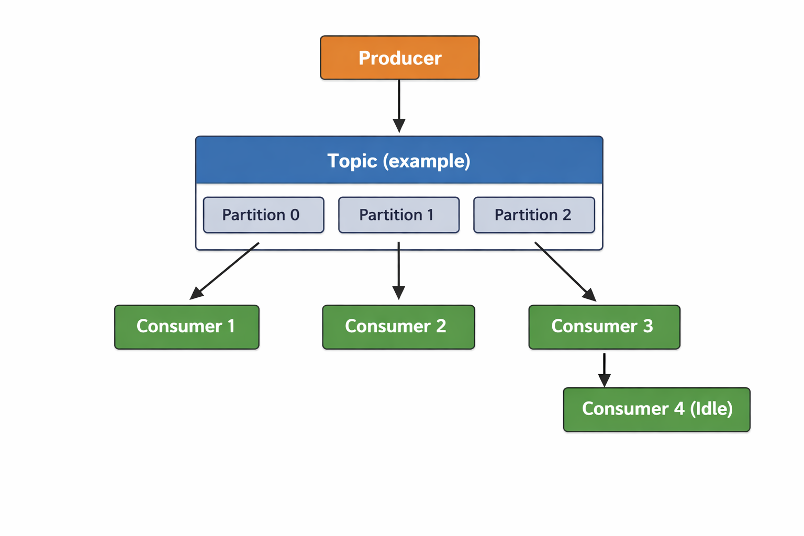
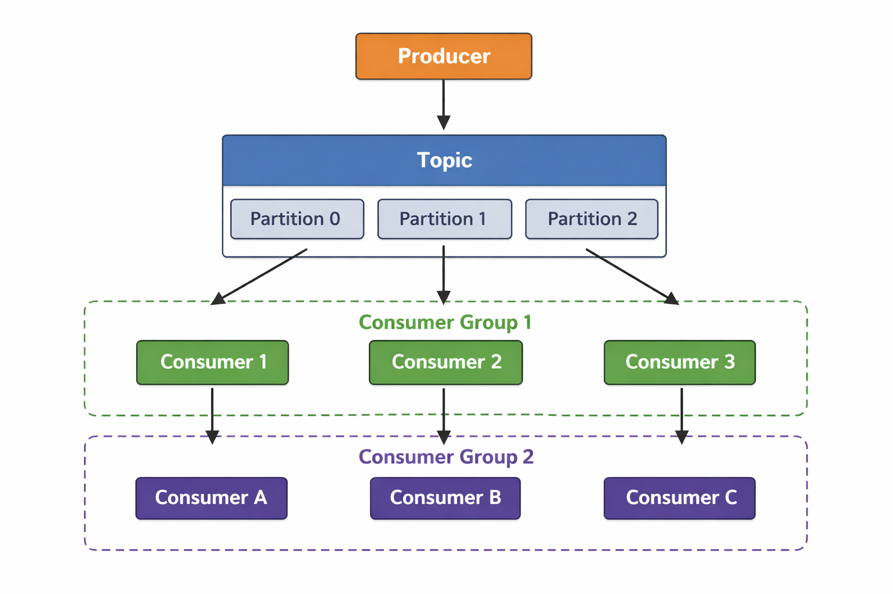

1. Kafka developed by linked In

Kafka is event driven -> store data -> emit data

2. Example 1 Zomato

  1. Lets take simple example without kafka zomato live location update
  2. When customer books an order 
  3. Delivery partner zomato (delivery guy) how live location will be recieved at customer end
  4. Basic steps
    1. Get current location of devlivery guy every seconds
    2. send location data to Zomato server
    3. Zomato server make entry in DB against TIME , location will be stored in latitude and longitude
    4. From server send back location to Customer 
    5. Big problem with this solution

# 3. Problem

  1. We know lets take in Bengaluru we have around 1000 (assumtion) delivery partners
  2. If every seconds 1000 insert request has been made to database 
  3. Lets say we are using SQL data base (mysql or psql)
  4. OPS (operation per second) is less
  5. Because of this db will go down
  6. Database "Throghtput" is less
  7. Throughtput means OPS (read and write seconds)

# 4. example 2 like discord chat app
  1. lets take we have 5000 users in one room and chatting
  2. sending messages to server
  3. if 1000 of messeges are coming to severe and also they needs to emit back to other user
  4. server will go down for sure
  5. Also we know every insert query in db will take some miliseconds to make entry (200ms)
  6. To send this back lets 200ms because of DB entry 
  7. then this is not real time

# 5. Example 3 uber/ola
  
  1. Relatime location driver and customer
  2. We know when we are fetching location info this needs to be used in multiple places (services)
  3. Services
    1. fare calculation
    2. Analytics
    3. customer

  4. Assume 1000 booking done so we need to make entry in all services tables
  5. 3* 1000 = 3000 insert request per second means throghtput is high but DB throughput is low 
  6. So DB will go down

# 6. KAFKA

  1. IMPORTANT -> kafka has high Throughput
  2. So we can use kafka right instead DB 
  3. No because KAFKA storage is temporary , it can't save daata for longer
  4. DB -> Throughput is very less But storage is high and also you can query DB
  5. DB is solving storage problem
  6. Kafka is solving Throughput problem

  7. Solutions for above three examples is we need to use both DB for storage and Kafka for Throughput

# 7. KAFKA basic uber

  1. Producers -> drivers
  2. consumers -> services -> fare, analytics, customers
  3. Produces will send data to kafka servers
  4. Consumers consumes data from kafka server 
  5. Perform some calculations and final bulk insert into DB 
  6. 1 Transcation = bulk insert -> time taking task

# 8. KAFKA Architecture

  1. Producers -> produces data to kafka sender
  2. Consumers ->  consumes data from kafka
  3. Topic -> partitioning data like table
  4. Partitions -> sharding split data into multiple partitions, (locations based, name based)

  5. Lets say 1 producer , 3 partitions and 4 consumers

    1. partition 1 will be consumed by consumer 1
    2. partition 2 will be consumed by consumer 2
    3. partition 3 will be consumed by consumer 3
    4. Consumer 4 will remain Idle

  6. Lets say 1 producer , 3 partitions and 1 consumers

    1. All 3 partitions consumed by 1 consumer

  7. Important note : Multiple partitions can consume by consumer, but 1 partition cannot be consumed by morethan 1 Consumer
  Meaning: already consumed partition cannot be consumbed by other consumer

  
  8. To over come this problem consumer groups

# 9. Consumer groups

  1. What they will do we have two consumer groups 1 and 2
  2. Consumer group 1 having 3 consumers
  3. Consumer group 2 having 2 consumers
  4. 3 Partitions
  5. In Consumer group 1, 3 consumers subscribing to 3 partitions 1:1
  6. In Consumer group 2, 1 consumer subscribing to 2 partitions (1:2) and 1 consumer subscribing to  partition (1:1)

# 10. KAFKA works on two principles

  1. Queue system -> one producer -> one consumer 1:1
      2 producer -> 2 consumers with group 1

  2. PUB-SUB -> One producer -> multiple consumers 1:4

      2 producer -> 2 consumers with in group 1 and 2 consumers with in group 2 here both group consumers consuming 2 producers

# 11. Auto balancing (Zookeper)

 12. kafka works on retention policy 
    1. retention.ms = -1 (no time limit)
    2. Then Kafka will keep data until disk is full.
    3. Disk full -> data get deleted on policy
    4. No Data backup
    5. It is not real time DB because we can't perform CRUD operations
    

