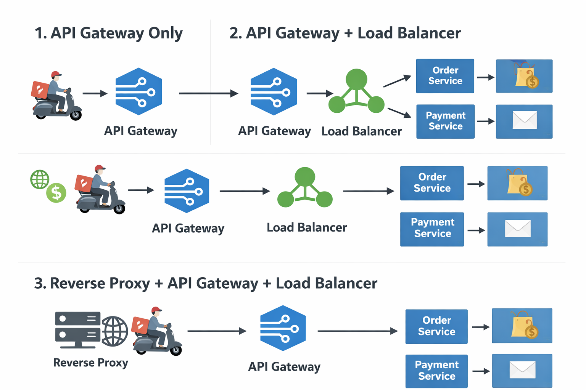

# Example Airport 

  1. Parking l1, l2 , l3 (distrubiting load load balancer)
  2. Security chekcking -> authrntication (passport) ,  authorization (ticket), routing, Rate limiting airlines (indigo, emiartes, air india) security checking, routing to microservivce (again microservice again have load balcing)
  3. Immigration (International flight) (Hiding Identity, caching static content) we don't need all time (ssl/tls)

1. Scenario 1 Small food deliver app

    API Gate way is enough , becuase we have 3-4 microservices, also it will provide level of load balancing

2. Scenario 2 Medium food deliver app

  1. API gateway -> routing, authentication, authorization, rate limiting
  2. Load balancer -> Microservices (differnt servers) -> Each service having again diffrent replicas to handle load 

3. Scenario 3 Large food deliver app (Zomato) 
  1. 50+ microservices
  2. 10 Millions of request 
  3. NGNIX revers proxy -> SSL/TLS , caching resturent images and food menus
  4. Revres proxy -> API gateway -> Load balancing

# load balancing 

  1. Distributing load same scope
  2. Basic authentication

# API gateway

  1. Routing
  2. Authentication
  3. Authorization
  4. Rate limiting
  5. If we are using Microservices , api gateway is mandatiry because each services hosted on diffrent servers , so that routing needs to be done at api gateway

# Reverse proxy

  1. SSL/TLS
  2. Hide exact ip
  3. Caching static data 

