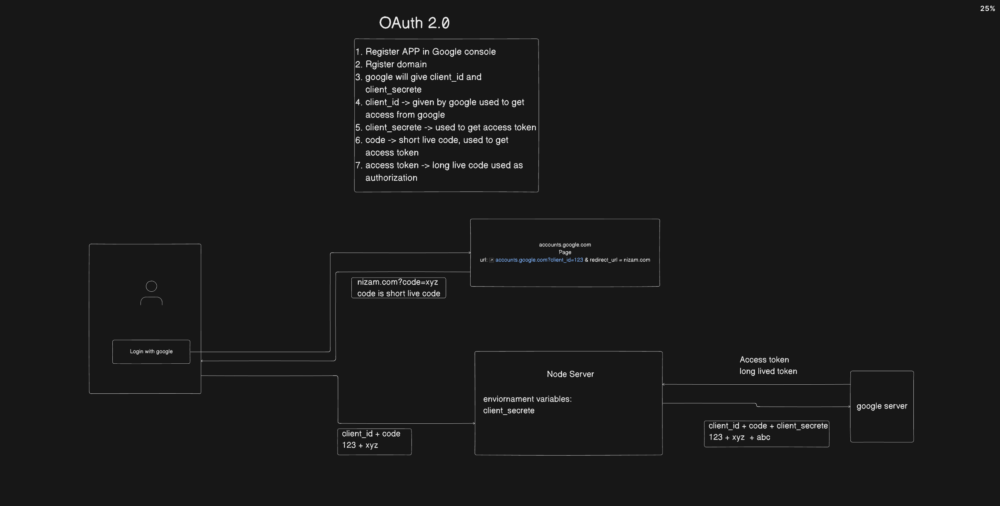

1. When we use OAuth -> basically I am using multiple Saas applications which has passord and username
2. It is difficult to remember username and password
3. Using Oauth we can login to app with other accounts, like google account, github account, or microsoft account
4. How we can implement
5. taking an example of google
6. Registering application in google console
  1. App name
  2. Domain name
7. It will give two codes
  1. client_id
  2. client_secreate

8. client click on login with google
9. redirect to google account page (account.google.com)
10. account.google.com?client_id = 123 & redirect_url = nizam.com
11. After client allowing access permission to google account
12. google will redirect to our website with code nizam.com?code=xyz
13. code is short live code
14. with this code make request to our node server, where we are storing client_secreate
15. From node server (client_id + code + client_secreate) -> google server
16. get Access token which has user details
17. we can use it as jwt token to get information

