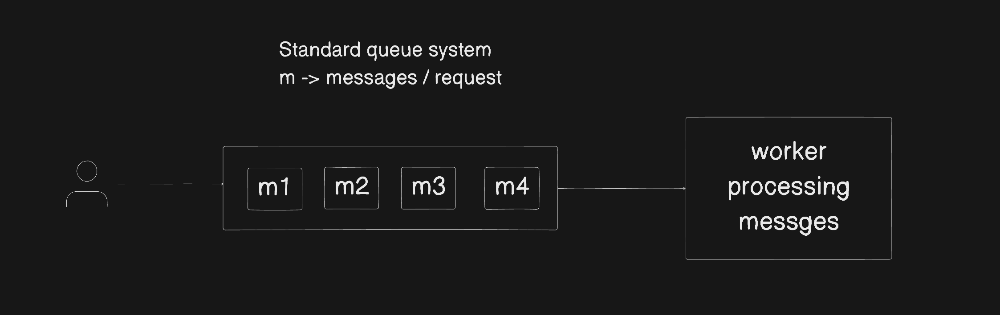
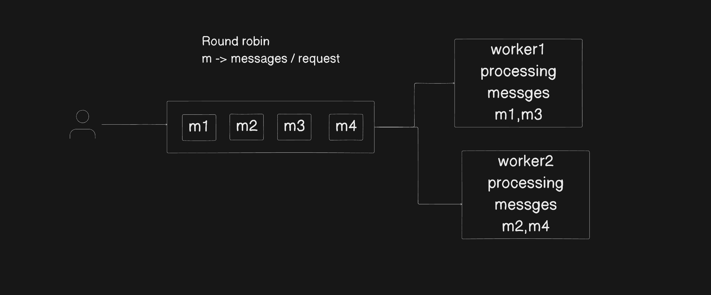
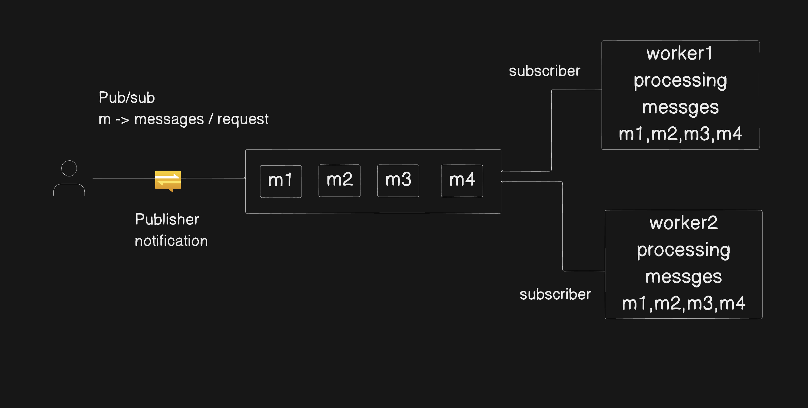
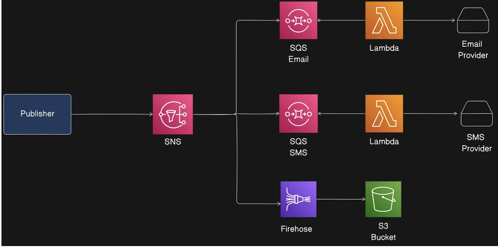
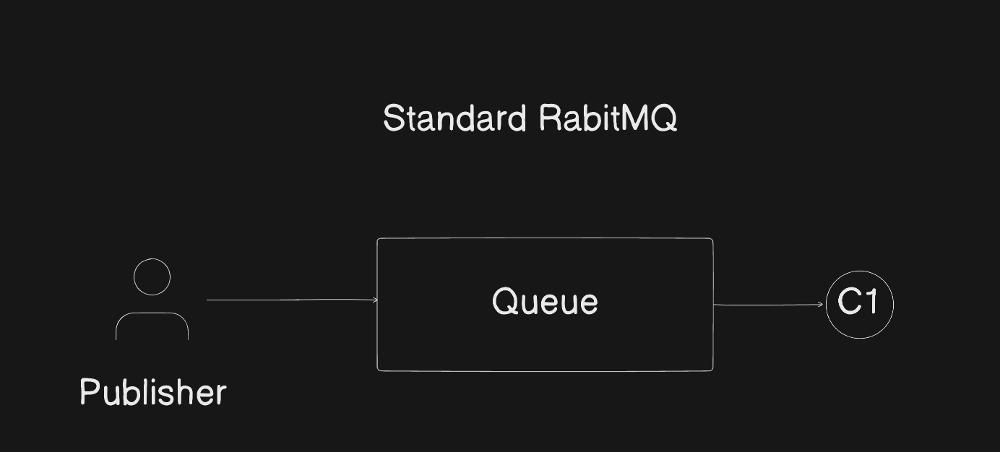
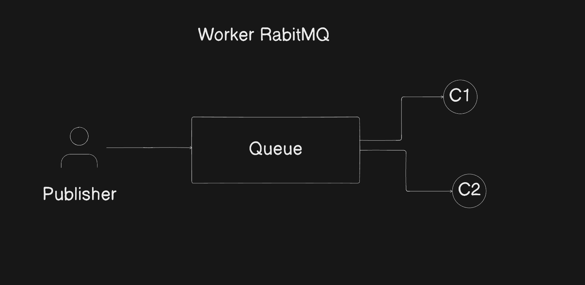
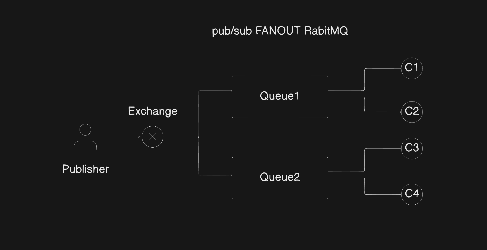
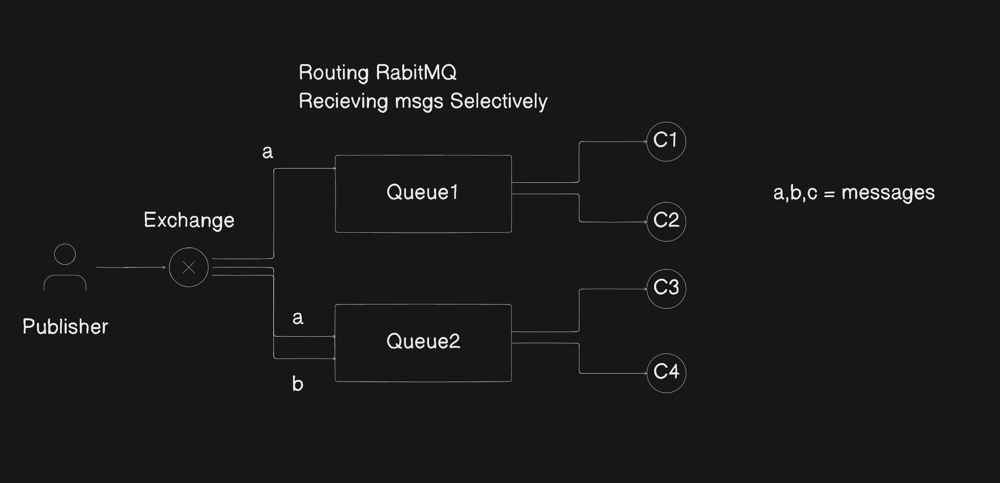
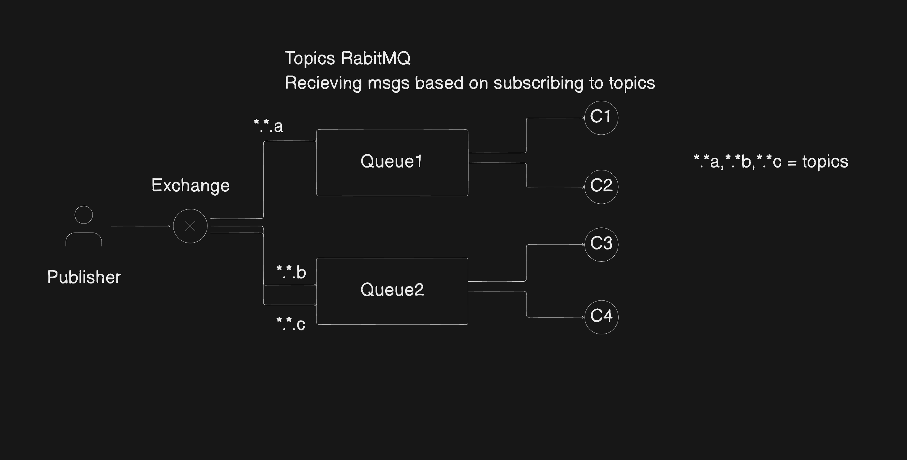
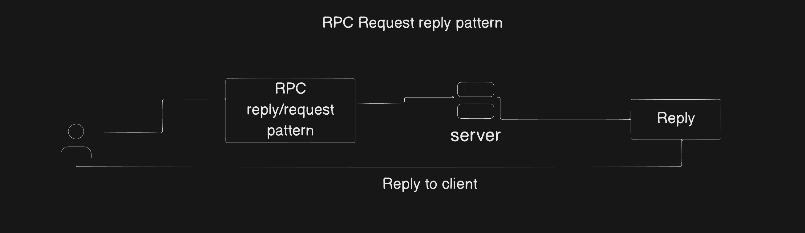

# Queues

1. To scale system queue architecture is more important
2. Let's say 1000 of messeges / requests coming but database will not handle all the msgs/requets ata time 
3. DB has less throghtput (operations per seconds)
4. To manage these queues system came up which has high throghput, we can't store data for loner time in queues but for some period of time
5. Why can' we use then queues as primary DB, we can't because if power failure , or failure occurs data will be lossed

6. How queue systems works

  1. Standard queue -> enqueue and dequeue

  

  2. Work Queue

    

  3. Pub/sub (publish and subscribe) FANOUT

  

7. Types of Queuing systems / Message brokers

  1. BullMQ
  2. SQS (Simple Queue system (Aws))
  3. Kafka 
  4. RabitMQ

# Types of Queuing systems / Message brokers

1. BullMQ

  1. This is Nodejs libraray built on top of Radis 
  2. If power fialure / system failure chances of lossing data
  3. FIFO Architecture 
  4. Auto removal jobs
      1. On failure
      2. On complete

   

  5. Gloabal Concurrency -> distribute jobs to diffrent workers parallely
  6. Easy to scale horizontally , we can add more workers

   

  7. It will not provide pub/sub architecture, we need to manully implement
  8. Disadvantage
     1. If messages increses 100 -> 1000 latency will increase , performence goes down

  9. BullMQ good at less messeges/jobs

2. SQS AWS (Simple queue system) 

  1. Support Standard (FIFO)
  2. Support pub/sub but we need to purchase (SNS) simple notification system aws 
  3. vendor lock , if we want to switch for other services difficult
  4. Compare to BullMQ performnce is constant (less), bullMq is faster but in case of less jobs
  5. Good at when jobs increase 100-> 1000/10000 performnce will not decrease it will reamin constant

  

3. Kafka (pub/sub FANOUT)
  
  1. Main components
    1. Publisher
    2. Consumer
    3. Topics
    4. Partitions
    5. Consumer Groups

  2. It can be both standard Queue system (FIFO) and Pub/Sub

    1. standard -> putting all consumers in one Consumer group called FIFO
    2. Pub/Sub -> putting consumers in diffrent groups so they can subscribe to all partitions

  3. Implement and manintainance is costly and difficult
  4. Not preferable for small projects
  5. Large projects can use it

4. RabitMQ 

  1. supports all possible queue systems 
  2. Its open source and easy to configure

  3. Types queuing architectures
    1. Standard FIFO -> publisher will publis message -> subscriber will take message from queue

       

    2. Worker queue -> publisher will publis message -> queue will distribute message to workers in Round robin

       

    3. PUB/SUB FANOUT -> 
      1. It uses exchange to notify queues
      2. Queues will pick all messages form excahnge
      3. send to workers

      

    4. Routing (selectively)

      1. Here exchange will notify queue 
      2. Queues will pick selective messages form excahnge

      

    5. Topics 
       
      1. Create topics and publish messages in topics using excahnge
      2. Queues will pick messages by subscribing to those topics

      

    6. RPC (reply/request pattern)

      1. Client will send message to RPC queue
      2. server will take
      3. reply back to client

      

