# Basic system design

1. Clients
2. Server
3. Data base

1. Client make request to server 
2. Server can be any machine like laptop, desktop, virtul server(EC2) available 24/7

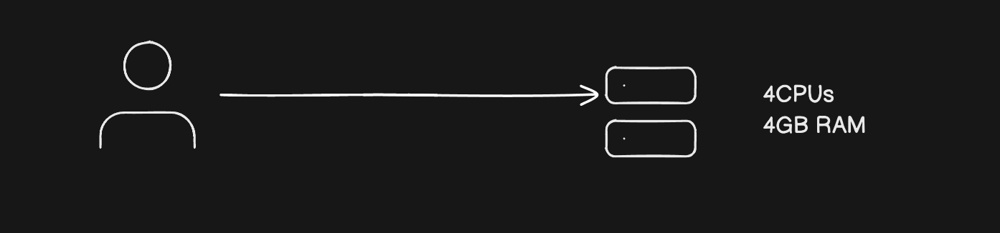

3. If lets say initiall 100 clients active , server configuration is 4 CPUs , 4GB RAM
4. Client increases to 1 million server with current config will crash

5. To solve this problem we need scale our server
6. Lets go with Vertical scaling
7. In vertical scaling we increase capacity of existing system for 1 Million users

-> 1000 CPUs
-> 128 GB RAM

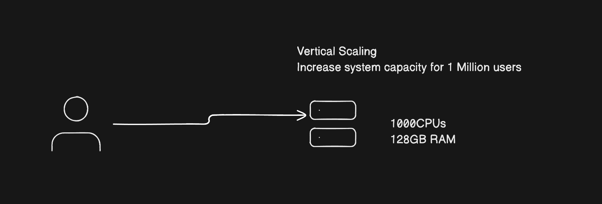

8. In vertical scaling we face one problem

  1. Down time
  2. When clients increases , we need to upgrade system
  3. when we are upgrading existing system , we need to restart system 
  4. When we restart system clients will face down time 

  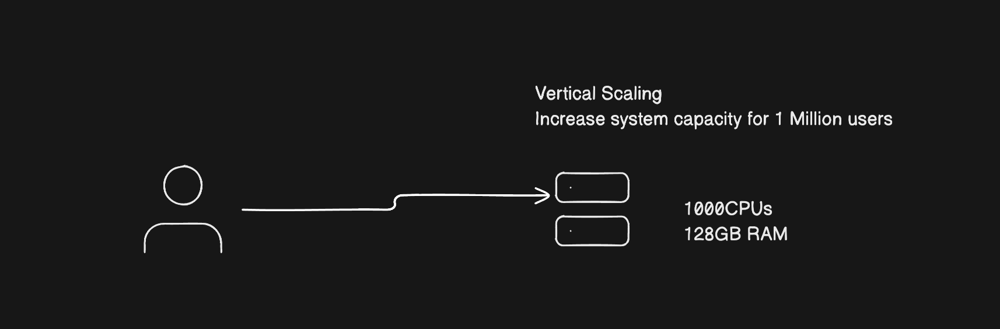

9. To over come down time we will go far Horizontal scaling

10. What is horizontal scaling

    Horizontal scaling is instead of upgrading existing machine , simply we add new machines with same config based on users , lets say 100 -> 1000 users increased we wan add 5 machines with same config and distribute request to 5 diffrent machines

    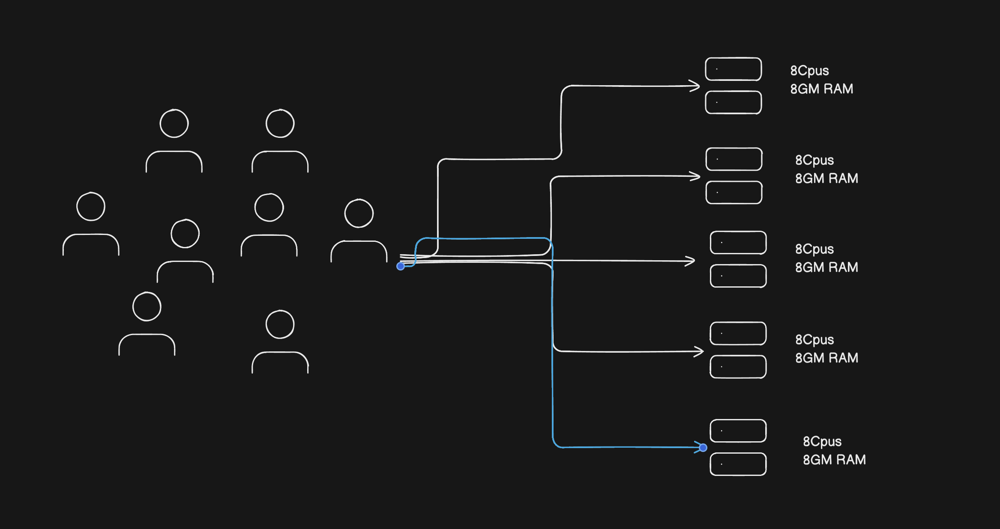

11. Who will distribute requests 

12. Load balancer will distribute request to diffrent servers

13. new server where load balancer is located 

    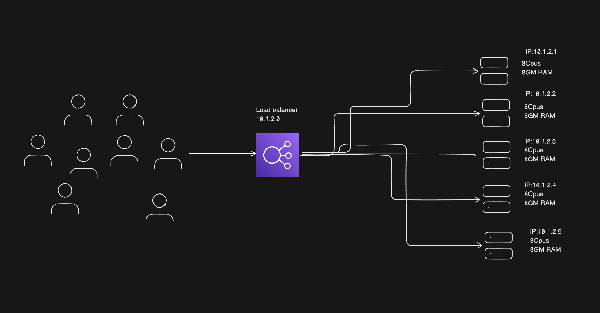

14. Requests will be distributed to diffrent server using some algorothem by LB

    1. Round robin

15. Microservices
    Microservices meaning multiple services -> divide functionality into multiple services

16. Amazon shopping app

    1. User service 
    2. Product/inventory service
    3. Order service
    4. Payment service
    5. Notification service

17. Problem with multiple services how we can route

    1. api.com/user -> user service
    2. api.com/product -> product service
    3. api.com/order -> order service
    4. api.com/payment -> payment service

18. API Gateway

    1. API gateway will be proivde routing
    2. APi gateway will provide authorization
    3. which will be on top of microservices

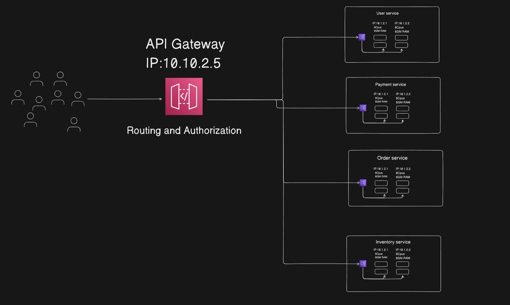

19. Problem -> Now we have to trigger email to users after payment success

  1. After payment done
  2. Synchronousely we are triggering mail 
  3. Using mail service providers
  4. Problem is we are  making it synchronous 
  5. user has to wait for mail send success
  6. if fails user will never goto success page

  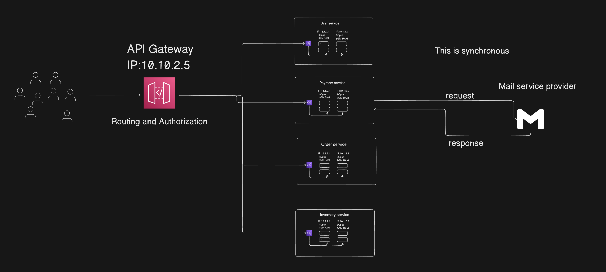

20. To solve this we have to go for asynchronous 

21. Worker (running in Background)

  1. where user will not wait for success of mail 
  2. here mail worker will be created which is running in back ground after success it will send mail

22. New problem is if mail server fails , email will not be sent 

23. EnQueue system (AWS SQS -> Simple queue system) -> to solve fail problem

  1. All request will go to email worker 
  2. email worker send request to queue (SQS)
  3. If fails put back into queue
  4. Retry will happen based on Exponetial Back off means request time will be double (0s,1s,2s,4s,8s,...)
  5. Max retry 10 
  6. after max retry it will go to DLQ
  7. Dead letter queue -> where user manually restart request
  10. Mail services also have rate limit like 30 req per seconds
  11. mail worker will send request in batch 25 req per seconds for safer side

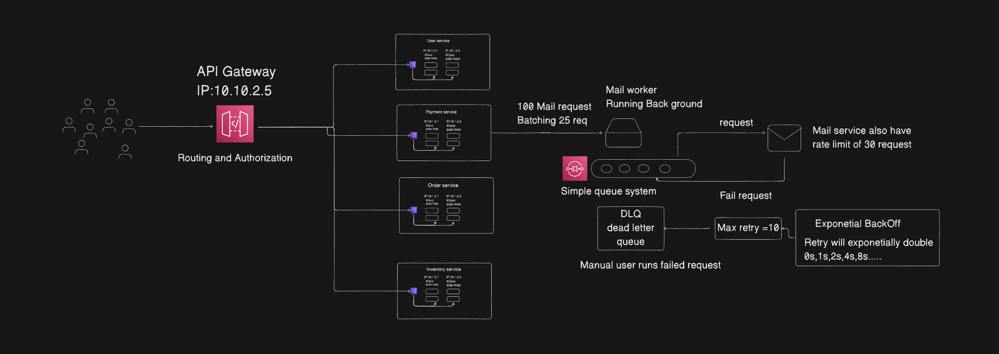

24. Enqueue system one producer and pne consumer at a time

25. problem only mail service is subscribing to payment but if multiple systems needs know payment is done

    1. Order service
    2. Notification service

26. We have to notify throught multiple sources

    1. Mail
    2. Whats app
    3. SMS

27. We can achive this by creating same queue system for sms, whats as created for email

    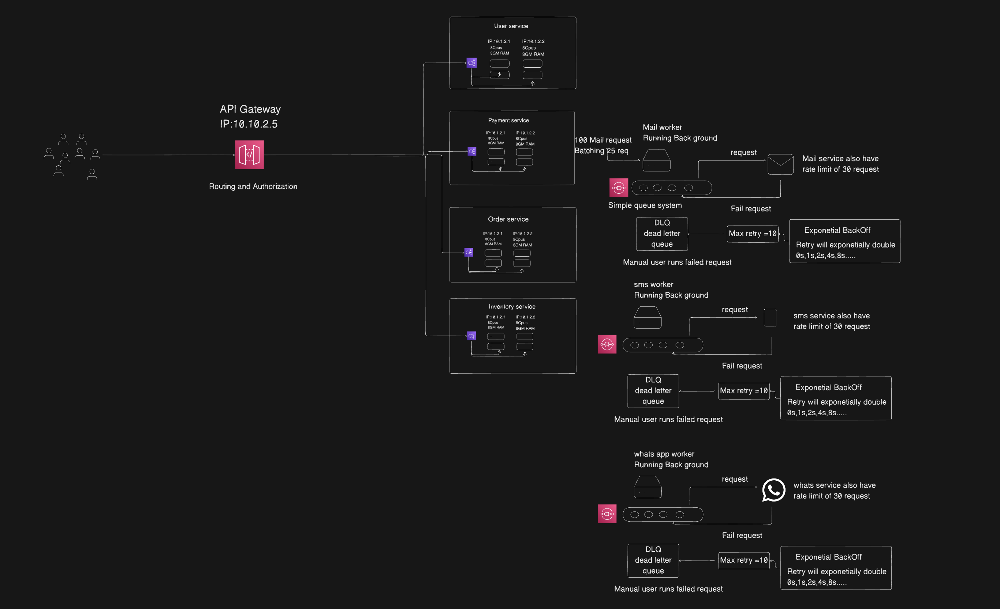

28. One problem we need to send request to three service sms, whats app, email individually

29. To solve this we came up with event driven system we call it as FAANOUT architecture

    1. In FAANOUT architecture what happens is we will use notification system
    2. which emit notification , whoever (services whats app, sms, email) wants that notification they all subscribe to that

    3. For that we have in aws SNS (Simple notification system)

30. Simple Notification system (SNS) with FAANOUT

  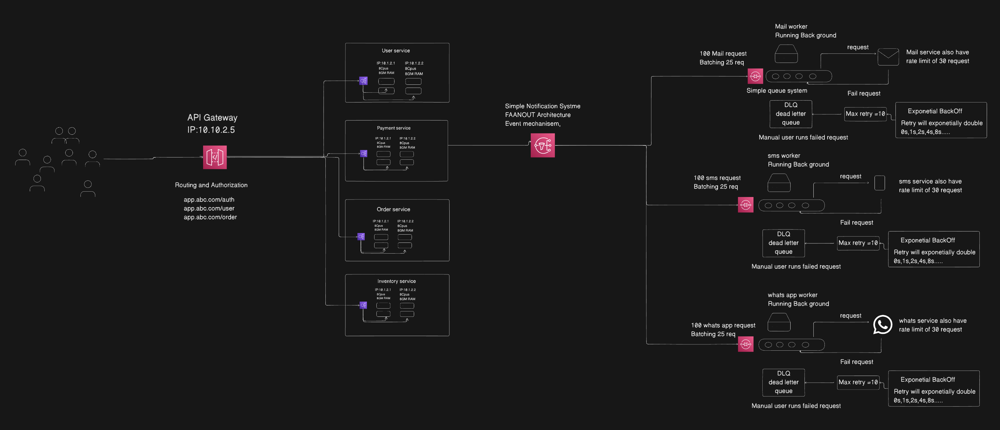

31. NGNIX -> reverse proxy 

    1. we can use it as load balancer
    2. static data caching (images , user details, products data)
    3. reverse proxy means exact server ip will not be exposed it is sit on front 

32. API Gateway is sit on load balancer where load balancer is seperate server

33. Radis server (caching at server and gateway level microservices)

  1. Radis is seperate server
  2. Used to cache data
  3. Initailly needs to fetch from server
  4. second time we can store it in radis mostly requested data 
  5. Avoide server load , faster response

  6. It can be single server or, multiple for each microservice

  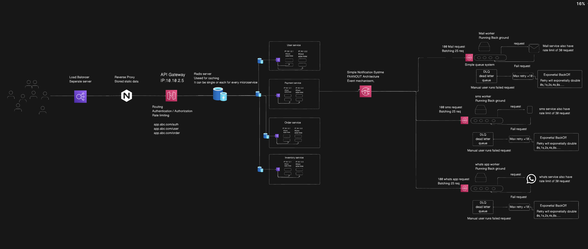

34. Problem: we have clients from diffrent countries , our server is hosted in INDIA

    1. Clients from diffrent region face slower responses
    2. Clients in India region faster responses 
    3. To solve this CDNs

35. CDN (Content delivery network) (AWS cloud front)

    1. These are hosted in each region 
    2. USA has one CDN, Canada has one CDN and soon
    3. First request go to cdn 
    4. Initially CDN don't have data 
    5. request will go to main server
    6. Next request will be cached in cdn it will not go to main server
    7. Used for cahing server data at diffrent regions

