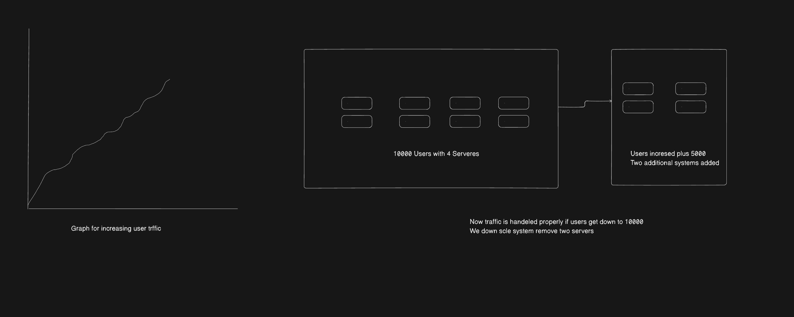
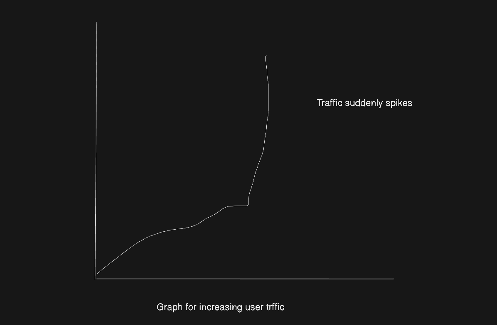
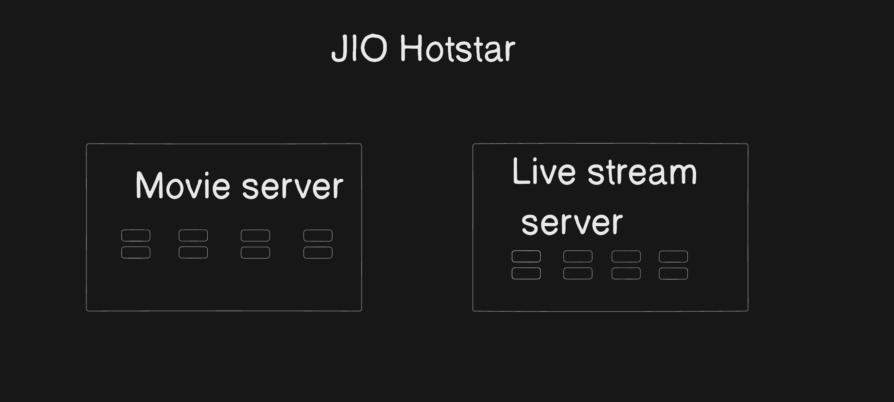
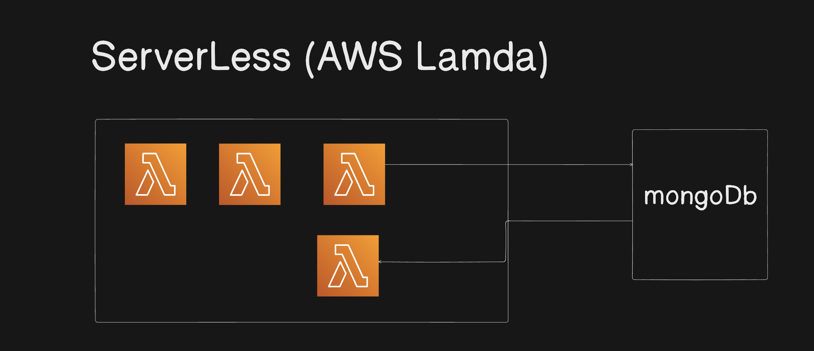

# Netflix system design

1. Netflix is OTT platform where we can watch movies, webseries
2. How the netflix scale their system
3. Let say daily in India region we have 10000 users watching movies and webseries
4. In that case traffic is normal, system is horizontal scaled 
5. If users increases to 15000 new two systems are added, traffic is handled normally
6. If users decreses , we down grade system 

7. Let's say on weekend traffic spikes immeditely , netflix is scaling system in sequence manner, if suddenly trffic increses server will go down

8. Solution to this is we need to pre paired , pred detrmined like on weekends draffic will be more , or when new movie get released traffic will be high

9. In that case we need to have more serveres as back up when traffic increses easily we can handle it 

# Jio Hot star

1. In Jio hot start we have two cases 
2. One is jio hotstar known for movies and webseries
3. One more case is live streaming of sports (ex: cricket, football, pro kabbadi)
4. How jio hotstar scale these system
5. In that case jio maintain two servers
    1. Movies one server
    2. Live stream one server

6. Users who wants to watch movie they will be redirecting movie server

7. Live stream like IND vs some big team match is going on
8. In that case let's say 25 crore peoples are watching live stream
9. Hotstar knows this day for 4 hours server will be busy, more trffic will be their 
10. In this case also more serveres will be active for 4 hours '
11. let's say important wicket is goes down form India team, traffic will decrease
12. But in that case also no need to down scale serveres, because at anytime again trffic will get increase
13. One more case if wicket goes down and match is not interesting
14. lets say 20 crore people of 25 crore will go for movie server right possible
15. we have to be prepared for movie server also 

# Problem statement with these

1. Cost effective , when we are adding new system cost will increase
2. We have to monitor these servers
3. server failure, server health, traffic increses, redirecting to new serveres

4. Solution: Therse is concept Called Server less

# Server less

1. Server less means , it is not server less
2. It is a server but we don't need to maintain,  we don't need to scale ,we don't need to monitor
3. AWS provide one service called AWS Lambda
4. AWS lambda is server less concept
5. This will provide platform where you can write code in any launguage (logic)
6. This will give you a public url as api gateway which you can call to trigger this functionality

7. How Lambda works
  Pros
  1. When users increases new lamda will be added to handle trffic autometically
  2. users down lamda will be removed
  3. Less cost per request 1m request = 0.20$

  Cons
  1. Initial start slow, it will be in sleep mode starting
  2. First request will take time
  3. Let's say we are connecting some mongoDB
  4. every lambda call new connections will be created
  5. To solve this we need one proxy server again  which costly
  6. If we are using lamda we can't go out oif aws
  7. storage we need to use S3
  8. Security IAM

  

  # solution 2

  1. We will go for horizontal scaling 
  2. To monitor these containerization
  3.  When we deploy our code we create containers for BE , FE
  4. What is containerization is virtualisation
  5. We know one problem code works on my machine
  6. This will come because i am using windows machine with node 20
  7. In server it is linux with Node 21 some dependency will fail
  8. To solve this we got VM (virtual machine)
  9. This will allow to install multiple os in single machine
  10. But problem is this is hevay, because complete OS is getting added
  11. To solve this problem new Concept called Docker
  12. Docker will not create an OS , it just create an image of ur project with project configs
  13. When ever we run that image it creates container which will work on all machines
  14. To maintain this containers we got another solution called Kubernetes

  # Kubernetes

  1. Kubernets will  provide container orchestration
  2. Monitoring containers
  3. Auto balancing
  4. restart conatiner if fails
  5. Montor container health (CPU and memoty usage)

